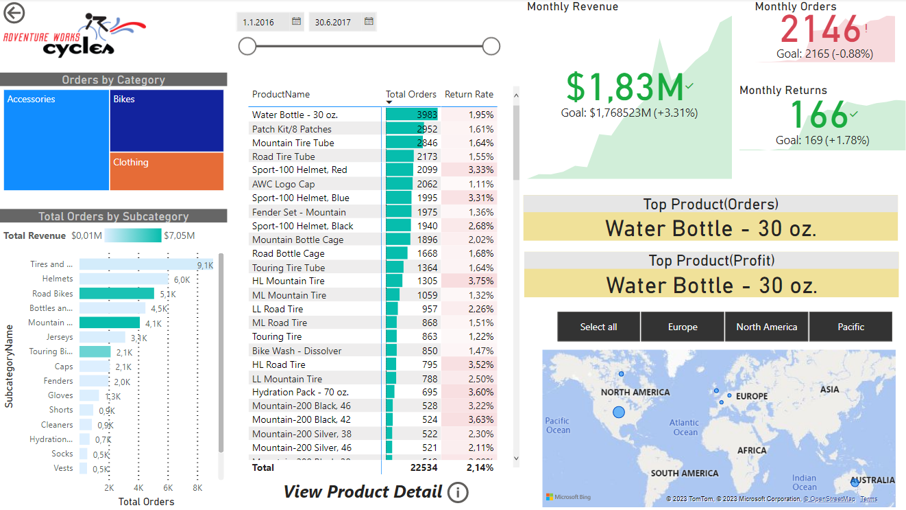
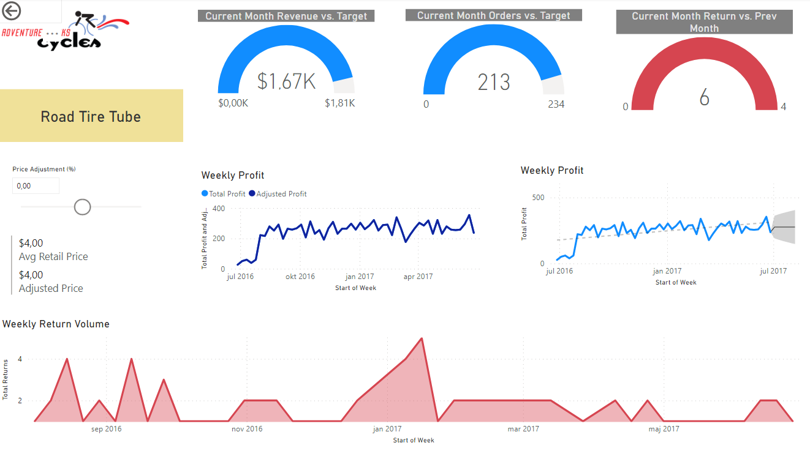
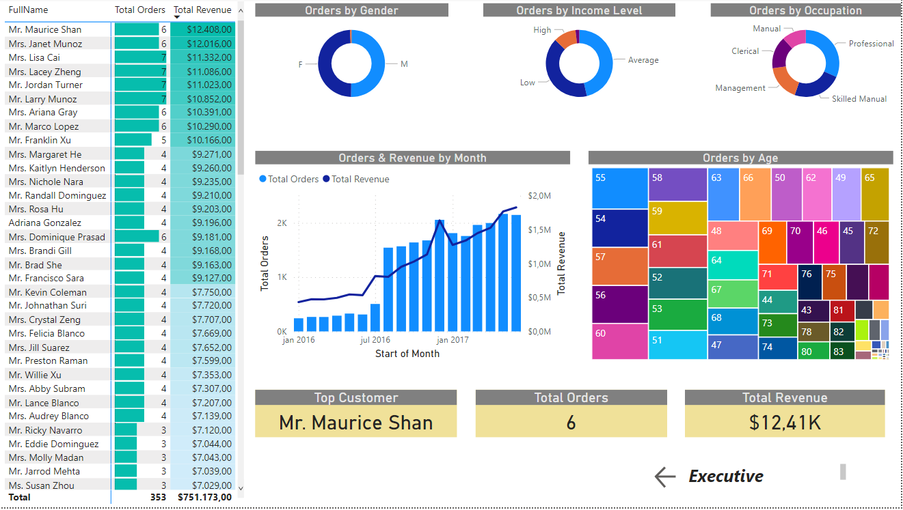

# Adventure Works Report - Power BI

This report was created as a project for the 'Microsoft Power BI Desktop for Business Intelligence' course on Udemy by Mahesh Nanavare. The aim of the project was to design and execute an end-to-end business intelligence solution to track key performance indicators (KPIs) such as sales, revenue, profit, returns, compare regional performance, analyze product-level trends and forecasts, and identify high-value customers for Adventure Works Cycles - a global manufacturing company.

## Adventure Works Analysis

Adventure Works Cycles is a global manufacturing company that required an end-to-end business intelligence solution to track KPIs, compare regional performance, analyze product-level trends and forecasts, and identify high-value customers.
The project includes the following:

* Connecting and transforming the raw data
* Creating table relationships and data models
* Creating new calculated columns and DAX measures
* Designing an interactive report to analyze and visualize the data

## Connect and transform the raw data

The project accessed data from database tables, flat files, folders and created fully automated data shaping and loading (ETL) procedures using the Power Query Editor. The main tabs of the Power Query Editor are 'Transform' and 'Add column', which include various tools to modify existing columns and create new columns based on conditional rules, text operations, calculations, dates, etc. Additionally, a calendar table was created, and conditional columns and hierarchies were used to reflect multiple levels of granularity.

## Creating table relationships and data models

Data modeling was used to connect multiple data sources in the BI tool using a relationship. The project contained two types of tables: data (or “fact”) tables, and lookup (or “dimension”) tables. Data tables contained numbers or values, typically at a granular level, with ID or “key” columns that can be used to create table relationships. Lookup tables provided descriptive, often text-based attributes about each dimension in a table. The project created snowflake schemas with chains of dimension tables, and relationships followed a “one-to-many” cardinality.

## Calculated columns and DAX measures

The project used Data Analysis Expressions (DAX), the formula language that drives Power BI, to add calculated columns and measures to the model. Calculated columns generated values for each row, which were visible within tables in the Data View. Measures were used to aggregate the data based on specific calculations, and DAX functions were used to create more complex calculations beyond the capabilities of traditional “grid-style” formulas.

## Conclusion

Overall, the Adventure Works Report - Power BI project successfully created an end-to-end business intelligence solution to track key performance indicators, compare regional performance, analyze product-level trends and forecasts, and identify high-value customers for Adventure Works Cycles.

## The Power BI Report View:

### 1. Exec Summary
  
### 2. Product Details 
  
### 3. Customer Details 

